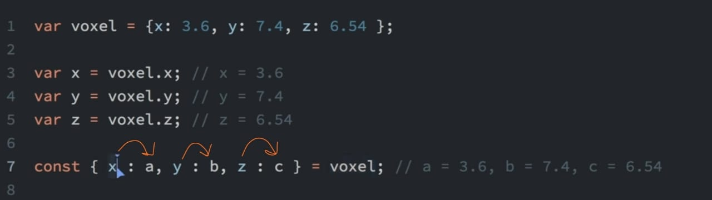

# JsRevision

#### Escape sequence in js start with \ <br>
- \" for printing double quotes in a string 
- \\ for backslash
- \? For question mark
- \n new line
- \t tab
- \b backspace


String variable cannot be mutated but can be reassigned with new string


#### Const let var <br>
- let : block scope variable
- const : same as let and prevents mutation
- var : accessible everywhere 

const array cannot be reassigned with new string but can be mutated

To completely prevent mutation we use Object.freeze() method 

// Const variable should be allcaps <br>
const MYCONST= { pi : 3.14} 

Object.freeze(MYCONST)

#### Anonymous functions or arrow functions

#### Rest operator for n number of arguments 

... Three dots 

```js
Var f = Function(...args) { //code} 
```

All the arguments will now be clubbed into an array. 

Spread operator for making a copy

```js
Arr1= ["a" , "b"]
Arr2 = [...arr1]; 
```

#### Destructuring assignment <br>


More or less same as unpacking 

[a,b] = [b,a]  // swapping <br>
const [z,x, , y] = [1,2,3,4,5] // 3 is skipped 

#### Setters and Getters
Setters and getters in js are defined same as functions but are used as properties. There was no ( ) used while calling of these properties.

Setter is used to set the values of properties getter is used to get the values of properties of an object

Definition of setters and getters
```
Set property_name() {
//Code }
```

Same with get<br> 
Both are Used in a class

#### Global and execution context 

<b>Global context </b>: all about collecting what has been written in the program. has window object in it

<b>Execution context</b> : when program is in execution line by line the execution blocks are stacked over global context. So in js when a function is called before its definition there's no error because global context is already knows about it. 

Two things that global context does with functions and variables

Function declarations are scanned and made available. 
Variable declarations are scanned and made undefined. 

One liner arrow functions : 
Const f = par => { //code }
F is used as function name while calling
Par is the parameter 
If multiple parameters are used then syntax is (par1,par2)
'

. every ( ) method is used on arrays which return true if something is true for each element of array 

Arr.every(iseven) //iseven is a user-defined function. Remember no parenthesis <br>
